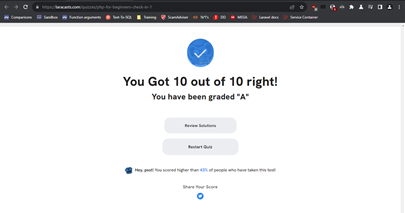

# PHP for Beginners Notes

#### This follows the [PHP for beginners](https://laracasts.com/series/php-for-beginners-2023-edition/episodes/1) series on Laracasts.
#### Relevant code and notes will be here.

## I. The Fundamentals

### 1. How to Choose a Programming Language
The correct choice depends on what you want to do.
* Wordpress / Laravel shop is the perfect situation for PHP.
* If you work with Shopify, you'll likely learn Ruby.
* (Not discussed in course) R or Python are great options for MLG

----

### 2. Tools of the Trade
> You are constantly inundated with choices you are not yet qualified to make.

Necessary Tooling
* Good code editor: [PHPStorm](https://www.jetbrains.com/phpstorm/), [VSCode](https://code.visualstudio.com/), or [Sublime Text](https://www.sublimetext.com/) are good options
* A Terminal is necessary; Windows and Mac 'ship with those out of the box', but you can use iTerm or Warp.
* PHP and MySQL, with [Homebrew](https://brew.sh/)(exclusively Mac) or [Composer](https://getcomposer.org)
* [Laragon](https://laragon.org/) is popular for Windows
* Docker, maybe

----

### 3. Your First PHP Tag
The directory you're working in needs to be the same as the root directory for your local environment.

`php -h` gives help
`php -S` lets you run your own development server
'index' is the default file name

```php
<h1>
    <?php echo "Hello World"; ?>
</h1>
```

----

### 4. Variables
Concatenation in PHP is done with `.`.
Variables are defined by `$` and characters.
Nesting is done inside `""` characters.

----

### 5. Conditionals and Booleans
> Think of a conditional as a way to create a branch in your project, or more simply, a way to ask a question.

Quick way to echo a message:
```php
<?= $variable ?>
```

----

### 6. Arrays
Define array
```php
$books = [
	"Do Androids Dream of Electric Sheep",
	"The Langoliers",
	"Hail Mary"
];
```
To render only
```php
echo "<li>{$book}™</li>";
```

Simple foreach
```php
<ul>
	<?php foreach ($books as $book) : ?>
		<li><?= $boook; ?></li>
	<?php endforeach; ?>
</ul>
```	

----

### 7. Assosciative Arrays
```php
<?php
$books = [
	[
		'name' => "Do Androids Dream of Electric Sheep",
		'author' => 'Philip K. Dick',
		'purchaseUrl' => 'http://example.com'
	],
	[
		'name' => "The Langoliers",
		'author' => 'Andy Weir',
		'purchaseUrl' => 'http://example.com'
	],
];
?>

<?php foreach ($books as $book) : ?>
	<ul>
		<li><a href="<?= $book['purchaseUrl'] ?>"><?= $book['name']; ?></a></li>
		<li>Author: <?= $book['author']; ?></li>
	</ul>
<?php endforeach; ?>
```

----

### 8. Functions and Filters
Filter using `if()`
Defining functions:
```php
function filterByAuthor($books, $author = 'Andy Weir')
{
	$filteredBooks = [];
	foreach($books as $book_
	{
		if($book['author'] === $author)
			$filteredBooks[] = $book;
	}
	return $filteredBooks;
}

foreach(filterByAuthor($books) as $book { /* ... */ }
```

----

### 9. Lamda functions
You don't have to name a function; you can assign to variable directly.
Meaning, you can do cool stuff like this:
```php
function filter($items, $fn)
{
	$result = [];

	foreach ($items as $item)
		if ($fn($item))
			$result[] = $item;

	return $result;
}


foreach (filter($books, function ($book) {
	return $book['year'] >= 2000; // Returns boolean
}) as $book) {}
```

Or, you can use `array_filter()` instead.

----

### 10. Separate Logic From the Template
You can separate your HTML and core PHP into different files, then connect them using `require` or `include`

----

### 11. Technical Check-in #1 (With Quiz)


----
----

## II. Dynamic Web Applications

### 12. Page Links
Took a Tailwind Dashboard starting page, the code can be found [here](https://laracasts.com/comments/28972)
Basic changes.

----

### 13. PHP Partials
Extracted the `heading`, `nav`, `banner` and `footer` sections as **partials**.

----

### 14. Superglobals and Current Page Styling
There are SuperGlobals like `$_POST`, `$_GET`, `$_SESSION` and `$_SERVER`.
You can extract a file like `functions.php`:
```
<?php
function urlIs($value)
{
    return $_SERVER['REQUEST_URI'] == $value;
}
```
Then call this file in every relevant file.

----

### 15. Make a PHP Router
